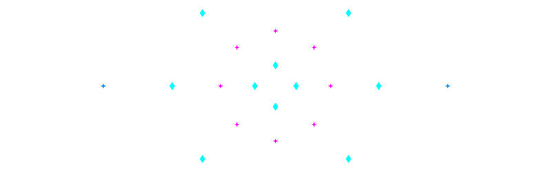

<!-- Ensure you upload animation.svg into your repository so this image displays! -->

  

# 👋 Hello, I'm Godfrey OUMA!

+Systems+Engineer+%7C+Computer+Scientist+and+Mathematical+Scientist+%7C+IT+Consultant" alt="Terminal Typing Effect" />

**Bridging mathematics and technology to create innovative solutions.**

I'm a Computer Scientist and Mathematical Scientist and IT Consultant with a strong passion for Open Source Software and DevOps. Currently pursuing an MSc in Computer Science, I specialize in developing robust IT solutions and infrastructure. With expertise in server administration, database management, and full-stack development, I bridge the gap between hardware and software to create efficient, scalable solutions. 

[LinkedIn](https://www.linkedin.com/in/godfrey-godson) · [Email](mailto:gee.mwerevu@gmail.com)

---

### 🔎 State & Focus
- 📍 **Location:** Nairobi, Kenya *(Update if needed)*
- 🔭 **Current Focus:** Pursuing an MSc in Computer Science. My work focuses on implementing modern technologies to solve real-world problems.
- ➗ **Research & Learning:** I'm particularly intrigued by the transformative potential of **STACK** (System for Teaching and Assessment using a Computer Algebra Kernel).
- 💡 **Status:** Open to collaboration on IT consulting, DevOps, and backend engineering projects.

---

### 🚀 About Me

I love turning complex mathematical logic into production-ready software. Holding a degree in Mathematics and Computer Science, I pair analytical problem solving with pragmatic engineering. My background spans:

- **Systems Engineering & DevOps:** Server administration, CI/CD, and robust IT infrastructure.
- **Backend & Database Management:** Designing high-performance, scalable databases and APIs.
- **Mathematical Modeling:** Leveraging maths to create intelligent applications.
- **Educator Support:** Utilizing tools like STACK to aid computer algebra in teaching environments.

---

### 🔧 Skills & Tech Stack

  <!-- Feel free to change these or add more based on your exact languages/frameworks -->
  
  
  
  
   
  
  

---

###  GitHub Highlights

  
  

---

### 📬 Let’s collaborate

If you have a product idea, need help with server management, or want to discuss the intersection of Mathematics and Computer Science—let’s chat!

  
  

